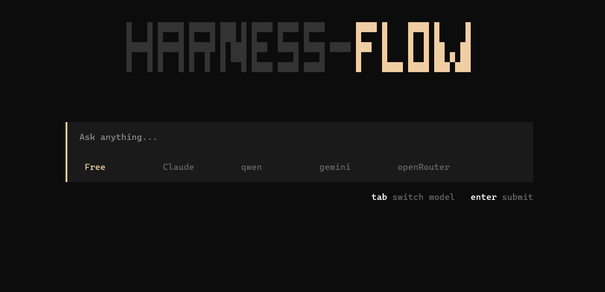

<div align="center">

```
██╗  ██╗ █████╗ ██████╗ ███╗   ██╗███████╗███████╗      ███████╗██╗      ██████╗ ██╗    ██╗
██║  ██║██╔══██╗██╔══██╗████╗  ██║██╔════╝██╔════╝      ██╔════╝██║     ██╔═══██╗██║    ██║
███████║███████║██████╔╝██╔██╗ ██║█████╗  ███████╗█████╗█████╗  ██║     ██║   ██║██║ █╗ ██║
██╔══██║██╔══██║██╔══██╗██║╚██╗██║██╔══╝  ╚════██║╚════╝██╔══╝  ██║     ██║   ██║██║███╗██║
██║  ██║██║  ██║██║  ██║██║ ╚████║███████╗███████║      ██║     ███████╗╚██████╔╝╚███╔███╔╝
╚═╝  ╚═╝╚═╝  ╚═╝╚═╝  ╚═╝╚═╝  ╚═══╝╚══════╝╚══════╝      ╚═╝     ╚══════╝ ╚═════╝  ╚══╝╚══╝
```

### Terminal-native AI agent · Multi-model · Tool-powered

[](https://bun.sh)
[](https://www.typescriptlang.org)
[](https://github.com/opentui/opentui)
[](https://openrouter.ai)

<br />



*A minimal, keyboard-first terminal interface for chatting with AI models and running agent tools.*

<br />

[Features](#features) · [Quick Start](#quick-start) · [Keyboard Shortcuts](#keyboard-shortcuts) · [Tools](#agent-tools) · [Models](#models)

</div>

---

## Overview

**Harness Flow** is a polished terminal AI assistant built on an agent loop with OpenAI-compatible tool calling. Pick a model, ask anything, and let the agent read files, run commands, search the web, drive a browser, manage git, and call MCP tools — all from a sleek, distraction-free TUI.

Born from the [Build Your Own Claude Code](https://codecrafters.io/challenges/claude-code) challenge, it goes beyond a basic CLI into a full interactive experience with session memory, streaming-style output, and rich markdown rendering.

---

## Features

### Interface

| | |
|---|---|
| **Retro-modern TUI** | Dark theme with cream accents, pixel logo, and a centered layout that stays out of your way |
| **Turn-based chat** | Each exchange lives in its own rounded panel — query on top, response below |
| **Markdown & code** | Responses render as markdown with syntax-highlighted code blocks |
| **Typewriter effect** | Assistant replies animate in character-by-character for a live feel |
| **Scrollable history** | Full conversation scrolls with sticky bottom anchoring and a styled scrollbar |
| **Model picker** | Switch between five model presets inline — no restart required |
| **Status & interrupt** | Running spinner while the agent works; press `Esc` to cancel mid-run |
| **Dual modes** | Interactive TUI for daily use, headless CLI for scripts and automation |

### Agent

| | |
|---|---|
| **Multi-turn sessions** | Conversation context persists across follow-up prompts in the same session |
| **Tool-calling loop** | Autonomous agent iterates until it has a final answer — reads, writes, executes, searches |
| **OpenRouter backend** | All models route through the OpenRouter API with a single key |
| **System prompt** | Behavior guided by a configurable markdown system prompt |
| **MCP integration** | External MCP servers (e.g. filesystem) are discovered and merged into the tool set at startup |

### Developer experience

| | |
|---|---|
| **Bun runtime** | Fast startup, native TypeScript, built-in file I/O |
| **Type-safe tools** | Tool schemas defined with structured parameters for reliable agent calls |
| **Env-based config** | API keys and endpoints loaded from environment variables |

---

## Quick Start

### Prerequisites

- [Bun](https://bun.sh) **1.3+**
- An [OpenRouter](https://openrouter.ai) API key
- *(Optional)* [Tavily](https://tavily.com) API key for web search

### Install & configure

```bash
git clone https://github.com/Saurabh-shukla1/Harness-Flow.git
cd Harness-Flow
bun install
```

Create a `.env` file in the project root:

```env
OPENROUTER_API_KEY=your_openrouter_key
OPENROUTER_BASE_URL=https://openrouter.ai/api/v1   # optional
TAVILY_API_KEY=your_tavily_key                     # optional, for web search
```

### Run

**Interactive TUI** *(recommended)*

```bash
bun run dev:tui
```

**Headless CLI**

```bash
bun run dev -- -free -p "Explain what this repo does"
```

Available model flags: `-free` · `-claude` · `-qwen` · `-gemini` · `-openRouter`

---

## Keyboard Shortcuts

| Key | Action |
|-----|--------|
| `Tab` | Toggle model selector |
| `Enter` | Submit prompt |
| `Esc` | Interrupt a running agent response |
| `Ctrl+C` | Exit the application |

---

## Models

Switch models anytime with `Tab` in the TUI, or pass a flag in CLI mode.

| Preset | Model |
|--------|-------|
| **Free** | `ibm-granite/granite-4.1-8b` |
| **Claude** | `anthropic/claude-haiku-4.5` |
| **Qwen** | `sourceful/riverflow-v2.5-pro:free` |
| **Gemini** | `google/gemini-3.1-flash-lite` |
| **OpenRouter** | `openrouter/owl-alpha` |

---

## Agent Tools

Harness Flow ships with a built-in toolkit the agent can invoke autonomously:

| Tool | Description |
|------|-------------|
| **Read / Write File** | Read and write files on the local filesystem |
| **Bash** | Execute shell commands and return stdout/stderr |
| **Get Current Directory** | Return the agent's working directory |
| **Web Search** | Search the web via Tavily with configurable depth |
| **Browse URL** | Fetch and extract content from a URL |
| **Browser Action** | Drive a headless browser (Puppeteer) — navigate, click, type, screenshot |
| **Get Current Datetime** | Return the current date and time |
| **Git Action** | Stage, commit, push, pull, diff, log, branch, and more |
| **MCP Tools** | Dynamically loaded from configured MCP servers (filesystem included by default) |

MCP servers are configured in `app/tools/mcp/mcp.json`. Add new servers there and they become available to the agent on next launch.

---

## Project Structure

```
app/
├── index.ts          # TUI entry point
├── main.ts           # CLI entry point
├── agent.ts          # Agent loop & session management
├── model/            # Model presets & selection
├── tools/            # Tool definitions & handlers
│   └── mcp/          # MCP server config & client
├── tui/              # Terminal UI components
│   ├── control-panel.ts
│   ├── content-area.ts
│   ├── turn-block.ts
│   └── theme.ts
└── prompt/           # System prompt
```

---

## Scripts

| Command | Description |
|---------|-------------|
| `bun run dev:tui` | Launch the interactive terminal UI |
| `bun run dev -- <flags> -p "prompt"` | Run a single prompt in headless mode |

---

<div align="center">

Built with curiosity · Inspired by [CodeCrafters](https://codecrafters.io/challenges/claude-code)

</div>
